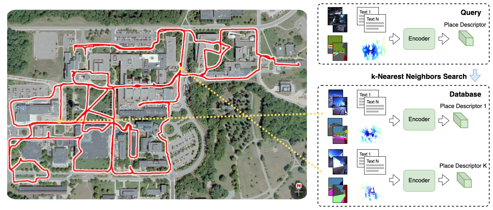

# Open Place Recognition library



_An overview of a typical place recognition pipeline. At first, the input data is encoded into a query descriptor. Then, a K-nearest neighbors search is performed between the query and the database. Finally, the position of the closest database descriptor found is considered as the answer._

### Featured modules

Detailed description of featured library modules can be found in the [docs/modules.md](./docs/modules.md) document.

1. [PlaceRecognitionPipeline](./docs/modules.md#1-placerecognitionpipeline)
2. [SequencePointcloudRegistrationPipeline](./docs/modules.md#2-sequencepointcloudregistrationpipeline)
3. [PlaceRecognitionPipeline with semantics](./docs/modules.md#3-placerecognitionpipeline-with-semantics)
4. [ArucoLocalizationPipeline](./docs/modules.md#4-arucolocalizationpipeline)
5. [LocalizationPipeline without dynamic objects](./docs/modules.md#5-localizationpipeline-without-dynamic-objects)
6. [Localization by specific scene elements (Semantic Object Context (SOC) module)](./docs/modules.md#6-localization-by-specific-scene-elements-semantic-object-context-soc-module)
7. [Module for generating global vector representations of multimodal outdoor data](./docs/modules.md#7-module-for-generating-global-vector-representations-of-multimodal-outdoor-data)
8. [MultimodalPlaceRecognitionTrainer](./docs/modules.md#8-multimodalplacerecognitiontrainer)
9. [TextLabelsPlaceRecognitionPipeline](./docs/modules.md#9-textlabelsplacerecognitionpipeline)
10. [DepthReconstruction](./docs/modules.md#10-depthreconstruction)
11. [ITLPCampus](./docs/modules.md#11-itlpcampus)

## Installation

### Pre-requisites

- The library requires `PyTorch`, `MinkowskiEngine` and (optionally) `faiss` libraries to be installed manually:
  - [PyTorch Get Started](https://pytorch.org/get-started/locally/)
  - [MinkowskiEngine repository](https://github.com/NVIDIA/MinkowskiEngine)
  - [faiss repository](https://github.com/facebookresearch/faiss)

- Another option is to use the docker image. You can read detailed description in the [docker/README.md](./docker/README.md).
  Quick-start commands to build, start and enter the container:

  ```bash
  # from repo root dir
  bash docker/build_devel.sh
  bash docker/start.sh [DATASETS_DIR]
  bash docker/into.sh
  ```

### Library installation

- After the pre-requisites are met, install the Open Place Recognition library with the following command:

    ```bash
    pip install -e .
    ```

### Third-party packages

- If you want to use the `GeoTransformer` model for pointcloud registration, you should install the package located in the `third_party` directory:

    ```bash
    # load submodules from git
    git submodule update --init

    # change dir
    cd third_party/GeoTransformer/

    # install the package
    bash setup.sh
    ```

### How to load the weights

You can download the weights from the public [Google Drive folder](https://drive.google.com/drive/folders/1uRiMe2-I9b5Tgv8mIJLkdGaHXccp_UFJ?usp=sharing).

<details>
  <summary>Developers only</summary>

  We use [DVC](https://dvc.org/) to manage the weights storage. To download the weights, run the following command (assuming that dvc is already installed):

  ```bash
  dvc pull
  ```

  You will be be asked to authorize the Google Drive access. After that, the weights will be downloaded to the `weights` directory. For more details, see the [DVC documentation](https://dvc.org/doc).
</details>

## ITLP-Campus dataset

We introduce the ITLP-Campus dataset. The dataset was recorded on the Husky wheeled robotic platform on the university campus and consists of tracks recorded at different times of day (day/dusk/night) and different seasons (winter/spring). You can find more detail in the [VitalyyBezuglyj/ITLP-Campus](https://github.com/VitalyyBezuglyj/ITLP-Campus) repository.

## Package Structure

### opr.datasets

Subpackage containing dataset classes and functions.

Usage example:

```python
from opr.datasets import OxfordDataset

train_dataset = OxfordDataset(
    dataset_root="/home/docker_opr/Datasets/pnvlad_oxford_robotcar_full/",
    subset="train",
    data_to_load=["image_stereo_centre", "pointcloud_lidar"]
)
```

The iterator will return a dictionary with the following keys:
- `"idx"`: index of the sample in the dataset, single number Tensor
- `"utm"`: UTM coordinates of the sample, Tensor of shape `(2)`
- (optional) `"image_stereo_centre"`: image Tensor of shape `(C, H, W)`
- (optional) `"pointcloud_lidar_feats"`: point cloud features Tensor of shape `(N, 1)`
- (optional) `"pointcloud_lidar_coords"`: point cloud coordinates Tensor of shape `(N, 3)`

More details can be found in the [demo_datasets.ipynb](./notebooks/demo_datasets.ipynb) notebook.

### opr.losses

The `opr.losses` subpackage contains ready-to-use loss functions implemented in PyTorch, featuring a common interface.

Usage example:

```python
from opr.losses import BatchHardTripletMarginLoss

loss_fn = BatchHardTripletMarginLoss(margin=0.2)

idxs = sample_batch["idxs"]
positives_mask = dataset.positives_mask[idxs][:, idxs]
negatives_mask = dataset.negatives_mask[idxs][:, idxs]

loss, stats = loss_fn(output["final_descriptor"], positives_mask, negatives_mask)
```

The loss functions introduce a unified interface:
- **Input:**
  - `embeddings`: descriptor Tensor of shape `(B, D)`
  - `positives_mask`: boolean mask Tensor of shape `(B, B)`
  - `negatives_mask`: boolean mask Tensor of shape `(B, B)`
- **Output:**
  - `loss`: loss value Tensor
  - `stats`: dictionary with additional statistics

More details can be found in the [demo_losses.ipynb](./notebooks/demo_losses.ipynb) notebook.

### opr.models

The `opr.models` subpackage contains ready-to-use neural networks implemented in PyTorch, featuring a common interface.

Usage example:

```python
from opr.models.place_recognition import MinkLoc3D

model = MinkLoc3D()

# forward pass
output = model(batch)
```

The models introduce unified input and output formats:
- **Input:** a `batch` dictionary with the following keys
  (all keys are optional, depending on the model and dataset):
  - `"images_<camera_name>"`: images Tensor of shape `(B, 3, H, W)`
  - `"masks_<camera_name>"`: semantic segmentation masks Tensor of shape `(B, 1, H, W)`
  - `"pointclouds_lidar_coords"`: point cloud coordinates Tensor of shape `(B * N_points, 4)`
  - `"pointclouds_lidar_feats"`: point cloud features Tensor of shape `(B * N_points, C)`
- **Output:** a dictionary with the requiered key `"final_descriptor"`
  and optional keys for intermediate descriptors:
  - `"final_descriptor"`: final descriptor Tensor of shape `(B, D)`

More details can be found in the [demo_models.ipynb](./notebooks/demo_models.ipynb) notebook.

### opr.trainers

The `opr.trainers` subpackage contains ready-to-use training algorithms.

Usage example:

```python
from opr.trainers.place_recognition import UnimodalPlaceRecognitionTrainer

trainer = UnimodalPlaceRecognitionTrainer(
    checkpoints_dir=checkpoints_dir,
    model=model,
    loss_fn=loss_fn,
    optimizer=optimizer,
    scheduler=scheduler,
    batch_expansion_threshold=cfg.batch_expansion_threshold,
    wandb_log=(not cfg.debug and not cfg.wandb.disabled),
    device=cfg.device,
)

trainer.train(
    epochs=cfg.epochs,
    train_dataloader=dataloaders["train"],
    val_dataloader=dataloaders["val"],
    test_dataloader=dataloaders["test"],
)
```

### opr.pipelines

The `opr.pipelines` subpackage contains ready-to-use pipelines for model inference.

Usage example:

```python
from opr.models.place_recognition import MinkLoc3Dv2
from opr.pipelines.place_recognition import PlaceRecognitionPipeline

pipe = **PlaceRecognitionPipeline**(
    database_dir="/home/docker_opr/Datasets/ITLP_Campus/ITLP_Campus_outdoor/databases/00",
    model=MinkLoc3Dv2(),
    model_weights_path=None,
    device="cuda",
)

out = pipe.infer(sample)
```

The pipeline introduces a unified interface for model inference:
- **Input:** a dictionary with the following keys
  (all keys are optional, depending on the model and dataset):
  - `"image_<camera_name>"`: image Tensor of shape `(3, H, W)`
  - `"mask_<camera_name>"`: semantic segmentation mask Tensor of shape `(1, H, W)`
  - `"pointcloud_lidar_coords"`: point cloud coordinates Tensor of shape `(N_points, 4)`
  - `"pointcloud_lidar_feats"`: point cloud features Tensor of shape `(N_points, C)`
- **Output:** a dictionary with keys:
  - `"idx"` for predicted index in the database,
  - `"pose"` for predicted pose in the format `[tx, ty, tz, qx, qy, qz, qw]`,
  - `"descriptor"` for predicted descriptor.

More details can be found in the [demo_pipelines.ipynb](./notebooks/demo_pipelines.ipynb) notebook.

## Model Zoo

### Place Recognition

| Model      | Modality | Train Dataset | Config | Weights |
| ---------- | -------- | ------------- | ------ | ------- |
| MinkLoc3D ([paper](https://openaccess.thecvf.com/content/WACV2021/html/Komorowski_MinkLoc3D_Point_Cloud_Based_Large-Scale_Place_Recognition_WACV_2021_paper.html)) | LiDAR | NCLT | [minkloc3d.yaml](./configs/model/place_recognition/minkloc3d.yaml) | `minkloc3d_nclt.pth` |
| Custom | Multi-Image, Multi-Semantic, LiDAR | NCLT | [multi-image_multi-semantic_lidar_late-fusion.yaml](./configs/model/place_recognition/multi-image_multi-semantic_lidar_late-fusion.yaml) | `multi-image_multi-semantic_lidar_late-fusion_nclt.pth` |
| Custom | Multi-Image, LiDAR | NCLT | [multi-image_lidar_late-fusion.yaml](./configs/model/place_recognition/multi-image_lidar_late-fusion.yaml) | `multi-image_lidar_late-fusion_nclt.pth` |

## Featured Projects

- [KirillMouraviev/simple_toposlam_model](https://github.com/KirillMouraviev/simple_toposlam_model) - An implementation of the Topological SLAM method that uses the OPR library.
- [VitalyyBezuglyj/ITLP-Campus](https://github.com/VitalyyBezuglyj/ITLP-Campus) - ITLP-Campus dataset tools.

## License

[MIT License](./LICENSE) (**_the license is subject to change in future versions_**)
