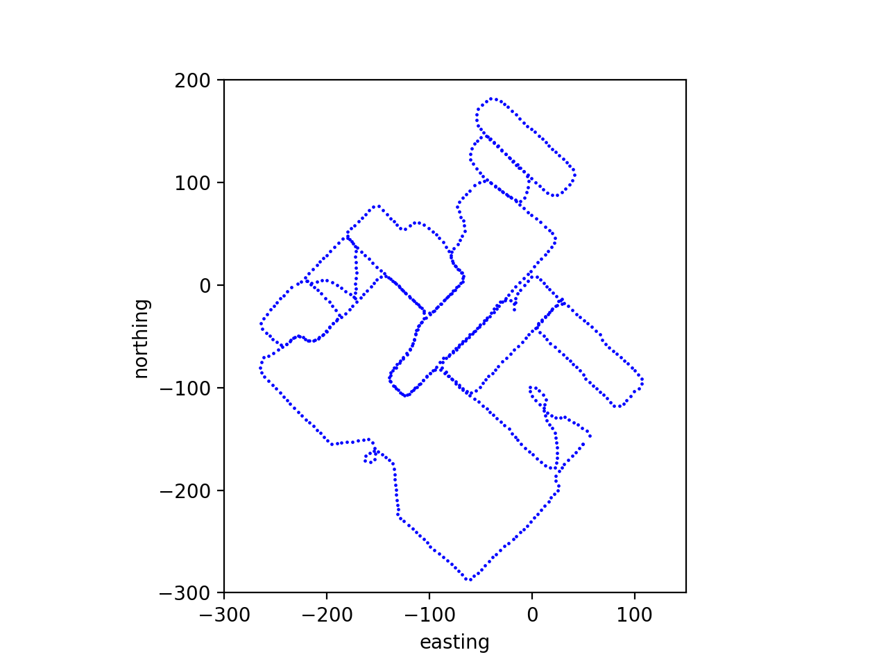
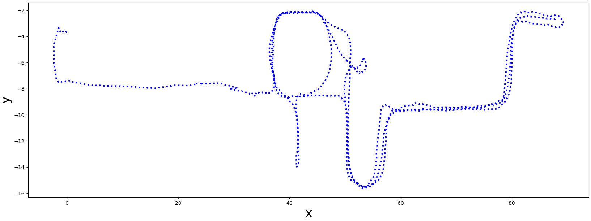
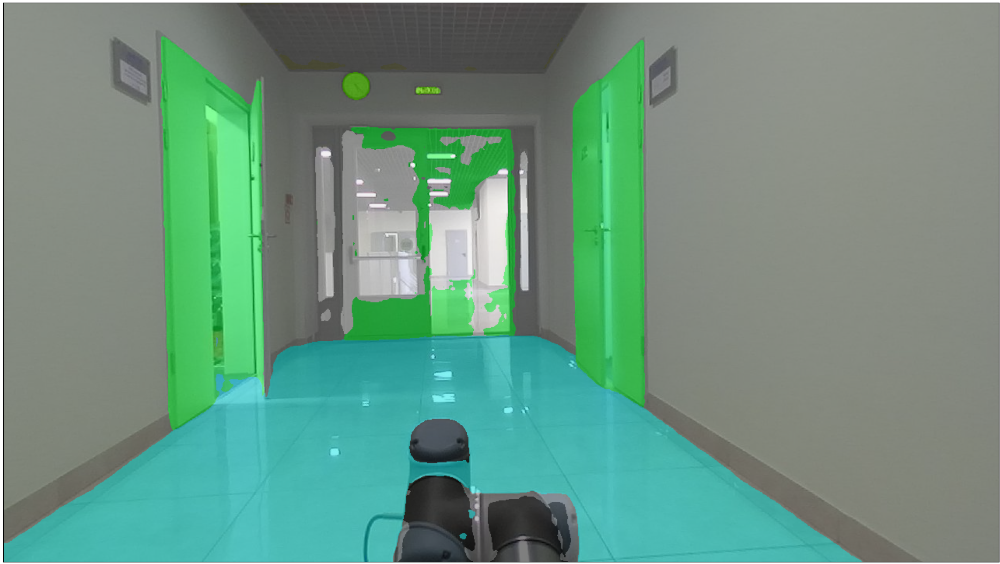
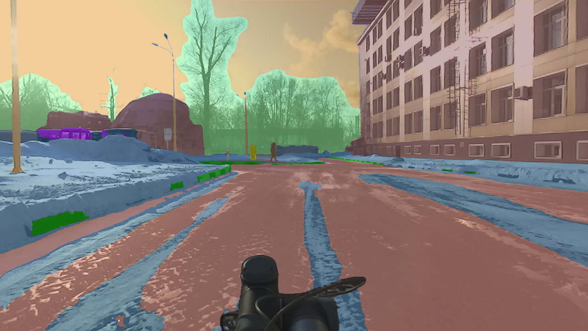

###################
ITLP-Campus Dataset
###################

.. image:: ../images/dataset-cover-husky.png
   :align: center
   :scale: 50%

Explore multimodal Place Recognition with ITLP Campus — a diverse dataset of indoor and outdoor university environments featuring synchronized RGB images,
LiDAR point clouds, semantic masks, and rich scene descriptions.
Built for real-world challenges, day or night, floor or field.

See also the `OPR-Project/ITLP-Campus <https://github.com/OPR-Project/ITLP-Campus>`_ repository.

Download
-------------

.. list-table::
   :widths: 25 25
   :header-rows: 1

   * - Cloud Storage
     - link
   * - Google Drive
     - `link1 <https://drive.google.com/drive/folders/14-0Ew5qVWh607tdFsovbXZsdWX-vU-Vy?usp=sharing>`_
   * - Yandex Disk
     - `link2 <https://disk.yandex.com/d/tvPdmWTTw5mEQg>`_

Sensors
-------------

.. list-table::
   :widths: 25 40 25
   :header-rows: 1

   * - Sensor
     - Model
     - Resolution
   * - Front cam
     - ZED (stereo)
     - 1280x720
   * - Back cam
     - RealSense D435
     - 1280x720
   * - LiDAR
     - VLP-16
     - 16x1824

Structure
-------------

The data are organized by tracks, the length of one track is about 3 km, each track includes about 600 frames. The distance between adjacent frames is ~5 m.

The structure of track data storage is as follows:

.. code-block:: shell

    Track ##
    ├── back_cam
    │   ├── ####.png
    │   └── ####.png
    ├── front_cam
    │   ├── ####.png
    │   └── ####.png
    ├── masks
    │   ├── back_cam
    │   │   ├── ####.png
    │   │   └── ####.png
    │   └── front_cam
    │       ├── ####.png
    │       └── ####.png
    ├── text_descriptions
    │   ├── back_cam_text.csv
    │   └── front_cam_text.csv
    ├── text_labels
    │   ├── back_cam_text_labels.csv
    │   └── front_cam_text_labels.csv
    ├── aruco_labels
    │   ├── back_cam_aruco_labels.csv
    │   └── front_cam_aruco_labels.csv
    ├── lidar
    │   ├── ####.bin
    │   └── ####.bin
    ├── demo.mp4
    ├── track.csv
    ├── meta_info.yml
    └── track_map.png

where

* ``####`` - file name, which is the timestamp of the image/scan (virtual timestamp of the moment when the image/scan was taken)
* ``.bin`` - files - LiDAR scans in binary format
* ``.png`` - images and semantic masks
* ``.csv`` :
    * ``<cam>_text.csv`` - text description of the scene for both front and back camera images (image timestamp, text description of the scene)
    * ``<cam>_aruco_labels.csv`` - information about aruco tags (image timestamp, tag bboxes and its ID)
    * ``<cam>_text_labels.csv`` - information only about images with text markings (image timestamp, marking bbox , text on the marking)
* ``track.csv`` - timestamp mapping for all data and 6DoF robot poses
* ``.yml`` - meta information about track

An example of a outdoor track trajectory (track_map.png):

An example of a indoor track trajectory (track_map.png):

ITLP-Campus Indoor
===================

Data
----

.. list-table::
   :header-rows: 1
   :widths: auto

   * - Track
     - Frames, pcs
     - Front cam, res
     - Back cam, res
     - LiDAR, rays
     - 6 DoF pose
     - Semantic masks
     - Aruco tag
     - OCR Text labels
   * - 2023-03-13
     - 3883
     - 1280x720
     - 1280x720
     - 16
     - ✓
     - 1280x720x150
     - ✓
     - ✓
   * - 00_2023-10-25-night
     - 1233
     - 1280x720
     - 1280x720
     - 16
     - ✓
     - 1280x720x150
     - ✓
     - ✓
   * - 01_2023-11-09-twilight
     - 1310
     - 1280x720
     - 1280x720
     - 16
     - ✓
     - 1280x720x150
     - ✓
     - ✓

6 DoF poses are obtained using Cartographer SLAM with global localization in a pre-built map.

Semantics
---------

Semantic masks are obtained using the `Oneformer <https://github.com/SHI-Labs/OneFormer>`_ pre-trained on the `ADE20K <https://ade20k.csail.mit.edu/>`_ dataset.

The masks are stored as mono-channel images. Each pixel stores a semantic label. Examples of semantic information are shown in the table below:

.. list-table::
   :header-rows: 1
   :widths: auto

   * - Label
     - Semantic class
     - Color, [r, g, b]
   * - ...
     - ...
     - ...
   * - 14
     - door; double door
     - [8, 255, 51]
   * - 23
     - sofa; couch; lounge
     - [11, 102, 255]
   * - 67
     - book
     - [255, 163, 0]
   * - 124
     - microwave; microwave; oven
     - [255, 0, 235]
   * - ...
     - ...
     - ...

The semantic markup contains a total of 150 classes. A complete table of all semantic classes is given in the table - `cfg/indoor_anno_description.md <https://github.com/OPR-Project/ITLP-Campus/blob/main/cfg/indoor_anno_description.md>`_. To map the ID labels with RGB colors you should use the configuration file - `cfg/indoor_anno_config.json <https://github.com/OPR-Project/ITLP-Campus/blob/main/cfg/indoor_anno_config.json>`_.

An example of a mask over the image:

ITLP-Campus Outdoor
====================

The outdoor part of this dataset was recorded on the Husky robotics platform on the university campus and consists of 5 tracks recorded at different times of day (day/dusk/night) and different seasons (winter/spring).

Data
----

.. list-table::
   :header-rows: 1
   :widths: auto

   * - Track
     - Season
     - Time of day
     - Frames, pcs
     - Front cam, res
     - Back cam, res
     - LiDAR, rays
     - 6 DoF pose
     - Semantic masks
     - Aruco tag
     - OCR Text labels
   * - 00_2023-02-21
     - winter
     - day
     - 620
     - 1280x720
     - 1280x720
     - 16
     - ✓
     - front + back
       1280x720x65 classes
     - ✓
     - ✓
   * - 01_2023-03-15
     - winter
     - night
     - 626
     - 1280x720
     - 1280x720
     - 16
     - ✓
     - front + back
       1280x720x65 classes
     - ✓
     - ✓
   * - 02_2023-02-10
     - winter
     - twilight
     - 609
     - 1280x720
     - 1280x720
     - 16
     - ✓
     - front + back
       1280x720x65 classes
     - ✓
     - ✓
   * - 03_2023-04-11
     - spring
     - day
     - 638
     - 1280x720
     - 1280x720
     - 16
     - ✓
     - front + back
       1280x720x65 classes
     - ✓
     - ✓
   * - 04_2023-04-13
     - spring
     - night
     - 631
     - 1280x720
     - 1280x720
     - 16
     - ✓
     - front + back
       1280x720x65 classes
     - ✓
     - ✓
   * - 05_2023-08-15
     - summer
     - day
     - 833
     - 1280x720
     - 1280x720
     - 16
     - ✓
     - front + back
       1280x720x65 classes
     - ✓
     - ✓
   * - 06_2023-08-18
     - summer
     - night
     - 831
     - 1280x720
     - 1280x720
     - 16
     - ✓
     - front + back
       1280x720x65 classes
     - ✓
     - ✓
   * - 07_2023-10-04
     - autumn
     - day
     - 896
     - 1280x720
     - 1280x720
     - 16
     - ✓
     - front + back
       1280x720x65 classes
     - ✓
     - ✓
   * - 08_2023-10-11
     - autumn
     - night
     - 895
     - 1280x720
     - 1280x720
     - 16
     - ✓
     - front + back
       1280x720x65 classes
     - ✓
     - ✓

6 DoF poses are obtained using ALeGO-LOAM localization method refined with Interactive SLAM.

Semantics
---------

Semantic masks are obtained using the `Oneformer <https://github.com/SHI-Labs/OneFormer>`_ pre-trained on the `Mapillary <https://paperswithcode.com/dataset/mapillary-vistas-dataset>`_ dataset.

The masks are stored as mono-channel images. Each pixel stores a semantic label. Examples of semantic information are shown in the table below:

.. list-table::
   :header-rows: 1
   :widths: auto

   * - Label
     - Semantic class
     - Color, [r, g, b]
   * - ...
     - ...
     - ...
   * - 10
     - Parking
     - [250, 170, 160]
   * - 11
     - Pedestrian Area
     - [96, 96, 96]
   * - 12
     - Rail Track
     - [230, 150, 140]
   * - 13
     - Road
     - [128, 64, 128]
   * - ...
     - ...
     - ...

The semantic markup contains a total of 65 classes. A complete table of all semantic classes is given in the table - `cfg/outdoor_anno_description.md <https://github.com/OPR-Project/ITLP-Campus/blob/main/cfg/outdoor_anno_description.md>`_. To map the ID labels with RGB colors you should use the configuration file - `cfg/outdoor_anno_config.json <https://github.com/OPR-Project/ITLP-Campus/blob/main/cfg/outdoor_anno_config.json>`_.

An example of a mask over the image:

PyTorch dataset API
====================

Implementation of PyTorch's dataset class for ITLP-Campus track is provided in the `src/opr/datasets/itlp.py <https://github.com/OPR-Project/OpenPlaceRecognition/blob/main/src/opr/datasets/itlp.py>`_ file.

That class can be used for loading the track's data in the format of ``torch.Tensor``.

Outdoor data
------------

Usage example:

.. code-block:: python

   track_dir = Path("/path/to/ITLP_Campus_outdoor/00_2023-02-21")

   dataset = ITLPCampus(
       dataset_root=track_dir,                      # track directory
       sensors=["front_cam", "back_cam", "lidar"],  # list of sensors for which you want to load data
       load_semantics=True,                         # whether to return semantic masks for cameras
       load_text_descriptions=False,                # whether to return text descriptions for cameras
       load_text_labels=False,                      # whether to return detected text labels for cameras
       load_aruco_labels=False,                     # whether to return detected aruco labels for cameras
       indoor=False,                                # indoor or outdoor track
   )

   data = dataset[0]  # will return dictionary with the first frame of the track
